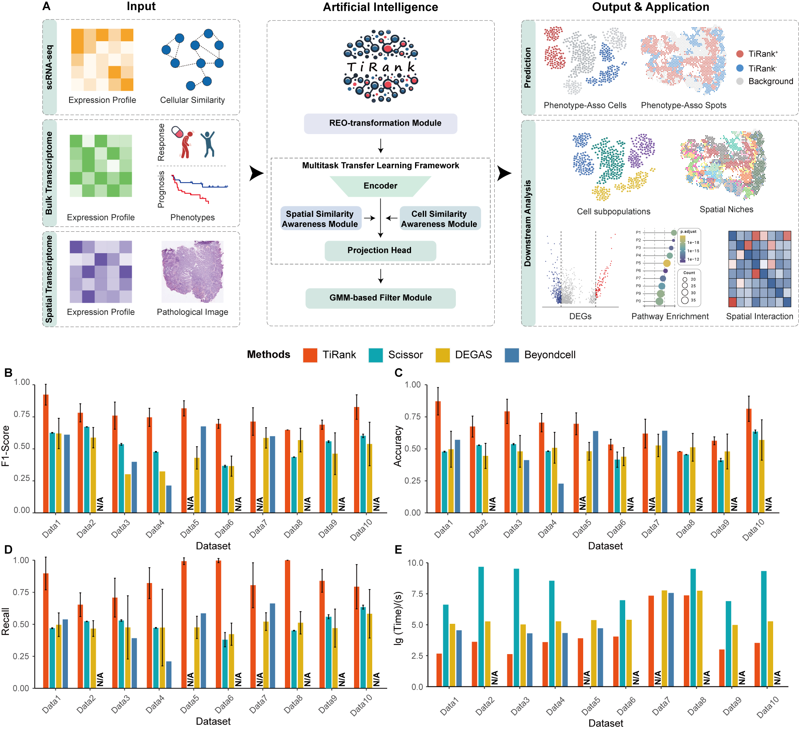
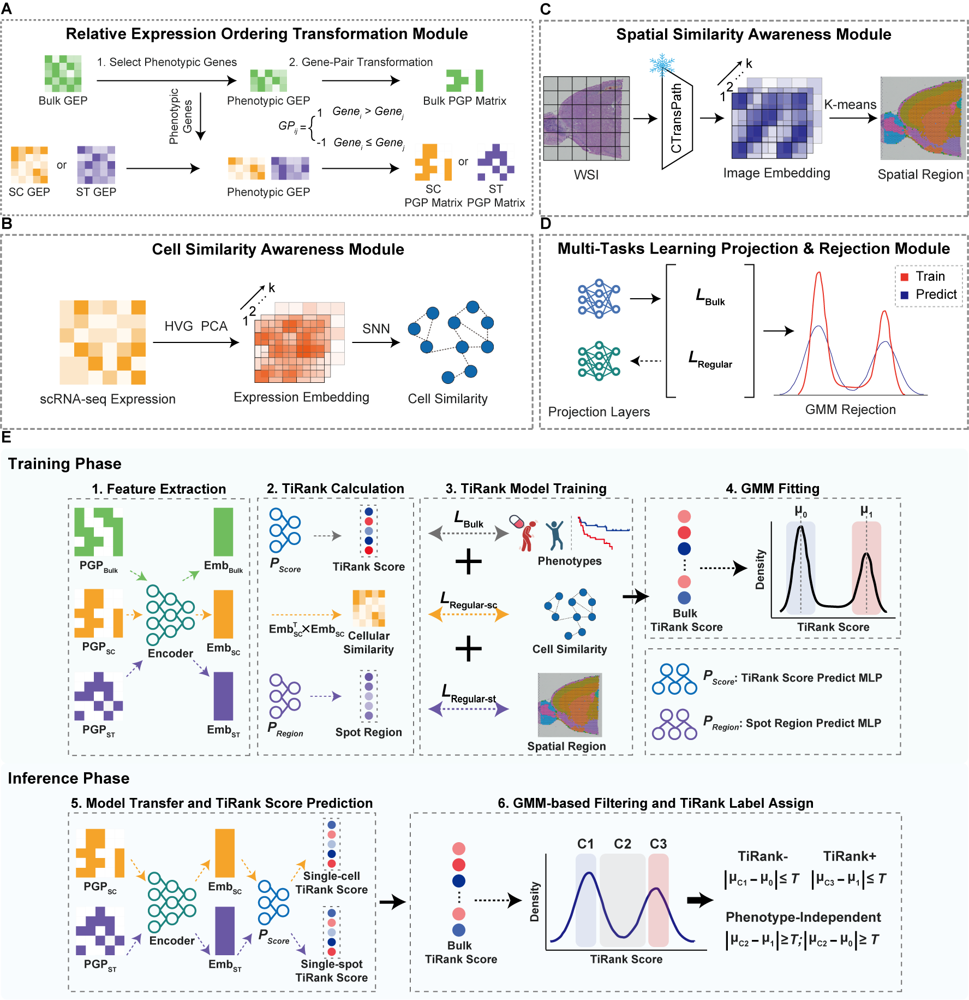

# TiRank


TiRank is a cutting-edge toolkit designed to integrate and analyze RNA-seq and single-cell RNA-seq (scRNA-seq) data. By seamlessly combining spatial transcriptomics or scRNA-seq data with bulk RNA sequencing data, TiRank enables researchers to identify phenotype-associated regions or clusters. The toolkit supports various analysis modes, including survival analysis (Cox), classification, and regression, providing a comprehensive solution for transcriptomic data analysis.



---

## Table of Contents

- 📚 [Quickstart Tutorials](#quickstart-tutorials)
- 🔢 [Model Input](#model-input)
- 🌟 [Features](#features)
- 🛠️ [Installation](#installation)
  - ⚙️ [Prerequisites](#prerequisites)
  - 🐍 [Method 1: pip Installation](#method-1-pip-installation)
  - 🐳 [Method 2: Docker](#method-2-docker)
  - 🌐 [Method 3: TiRank-GUI](#method-3-interactive-web-tool)
- 📊 [Result Interpretation](#result-interpretation)
- ⚙️ [Hyperparameters](#hyperparameters)
  - 🔍 [Feature Selection Hyperparameters](#feature-selection-hyperparameters)
  - 🎛️ [Model Training Hyperparameters](#model-training-hyperparameters)
- 🧑‍💻 [Support](#support)
- 📜 [License](#license)

---

## Quickstart Tutorials

### Examples:

1. **Integrating scRNA-seq Data for Melanoma Response Analysis**
   - Demonstrates the integration of single-cell RNA-seq data with response information.
   - [Example Script](Example/SC-Response-SKCM.py)

2. **Combining Spatial Transcriptomics and Bulk Data for Phenotype Detection**
   - Identifies phenotype-associated spots and determines significant clusters.
   - [Example Script](Example/ST-Cox-CRC.py)

3. **Comprehensive Downstream Analysis**
   - Showcases downstream analyses based on TiRank results, emphasizing spatial structures associated with clinical phenotypes.
   - [Example Workflow](Downstream/CRC)

---

## Model Input

### Requirements:

- **Spatial Transcriptomics or Single-Cell Data**:
  - Data to characterize spatial or cellular heterogeneity.
- **Bulk Transcriptomics Data**:
  - Expression profiles and pre-processed clinical information files. Ensure the clinical information format aligns with the sample data provided.

### Example Data:
- 📥 Download sample datasets from [Google Drive](https://drive.google.com/drive/folders/1CsvNsDOm3GY8slit9Hl29DdpwnOc29bE).

---

## Features

- **🔗 Seamless Data Integration**:
  - Combines bulk RNA-seq with single-cell or spatial transcriptomics data.

- **🔄 Versatile Analysis Modes**:
  - Includes survival analysis (Cox), classification, and regression.

- **📈 Advanced Visualization**:
  - Offers tools for generating UMAP plots, spatial maps, and other visualizations.

- **⚙️ Customizable Hyperparameters**:
  - Provides flexibility to fine-tune settings for optimized results.

---

## Installation

TiRank supports multiple installation methods. It is recommended to create a dedicated conda environment to ensure compatibility.

### Method 1: Environment Setup and Installation

You can set up the full TiRank environment directly with the following commands:

```bash
cd TiRank
conda env create -f environment.yml
```
Then, activate the environment and run TiRank:

```bash
conda activate Tirank
```
---
`Note`: The TiRank framework has been tested on `Ubuntu 22.04` with `Python 3.9`, using `NVIDIA Driver 12.4` and `RTX 3090 GPUs`.


<!-- ### Prerequisites

- **Anaconda or Miniconda**
- **Python 3.9**

### Method 1: pip Installation

1. **Create a Conda Environment**:

   ```bash
   conda create -n TiRank python=3.9 -y
   conda activate TiRank
   ```

2. **Clone the TiRank Repository**:

   ```bash
   git clone git@github.com:LenisLin/TiRank.git
   ```

3. **Install TiRank**:

   ```bash
   pip install TiRank
   ```

4. **Install Dependencies**:

   TiRank requires the `timm==0.5.4` package from [TransPath](https://github.com/Xiyue-Wang/TransPath). Install it as follows:

   ```bash
   pip install ./TiRank/timm-0.5.4.tar
   ```

5. **Download Example Data**:
   - Access sample datasets via [Google Drive](https://drive.google.com/drive/folders/1CsvNsDOm3GY8slit9Hl29DdpwnOc29bE).

6. **(Optional) Pretrained Model for Spatial Transcriptomics**:
   - Download the pre-trained [CTransPath](https://drive.google.com/file/d/1DoDx_70_TLj98gTf6YTXnu4tFhsFocDX/view) model weights. -->

### Method 2: Docker

1. **Install Docker**:
   - Ensure Docker is installed on your system.

2. **Pull the TiRank Docker Image**:

   ```bash
   docker pull lenislin/tirank_v1:latest
   ```

3. **Run the Docker Container**:

   ```bash
   docker run -p 8050:8050 lenislin/tirank_v1:latest /bin/bash
   ```

4. **Verify Container Execution**:

   After running the above command, you should be inside the container's terminal. Verify the setup by checking the TiRank version:

   ```bash
   conda activate TiRank
   
   python -c "import TiRank; print(TiRank.__version__)"
   ```

5. **Persistent Data Storage**:
   - Mount a local directory to retain data:

   ```bash
   docker run -it -v /path/to/local/data:/container/data lenislin/tirank_v1:latest /bin/bash
   ```

6. **Stop and Remove the Docker Container**:
   - Use the following commands to manage containers:

   ```bash
   docker stop <container_id>
   docker rm <container_id>
   ```

### Method 3: Interactive Web Tool

1. **Set Up the Web Server**:
   - Navigate to the Web directory:

     ```bash
     cd TiRank/Web
     mkdir data
     ```

   - Download the required datasets and pretrained models into the `data` directory:
     - [Pretrained Models](https://drive.google.com/file/d/1DoDx_70_TLj98gTf6YTXnu4tFhsFocDX/view)
     - [Example Data](https://drive.google.com/drive/folders/1CsvNsDOm3GY8slit9Hl29DdpwnOc29bE)

2. **Set Up Directory Structure**:

   Ensure the following directory structure is maintained:

   ```
   Web/
   ├── assets/
   ├── components/
   ├── img/
   ├── layout/
   ├── data/
   │   ├── pretrainModel/
   │   │   └── ctranspath.pth
   │   ├── ExampleData/
   │   │   ├── CRC_ST_Prog/
   │   │   └── SKCM_SC_Res/
   ├── tiRankWeb/
   └── app.py
   ```

3. **Run the Web Application**:

   - Execute the following command:
     ```bash
     python app.py
     ```

4. **Access the Web Interface**:
   - Open a web browser and navigate to `http://localhost:8050` to access the TiRank GUI.

---

## Result Interpretation

TiRank outputs results in the `savePath/3_Analysis/` directory. Key outputs include:

- **📂 `spot_predict_score.csv`**:
  - Contains TiRank predictions in the `Rank_Label` column.

### Modes of Analysis:

- **📉 Cox Survival Analysis**:
  - `TiRank+` spots indicate **worse survival outcomes**.
  - `TiRank-` spots indicate **better survival outcomes**.

- **✅ Classification**:
  - `TiRank+` spots are associated with the phenotype encoded as `1`.
  - `TiRank-` spots are associated with the phenotype encoded as `0`.

- **📈 Regression**:
  - `TiRank+` spots correspond to **high phenotype scores**.
  - `TiRank-` spots correspond to **low phenotype scores** (e.g., drug sensitivity).

---

## Hyperparameters

### Feature Selection Hyperparameters

1. **`top_var_genes`**:
   - Default: `2000`
   - Recommendation: Increase if gene selection is insufficient.

2. **`p_value_threshold`**:
   - Default: `0.05`
   - Recommendation: Adjust based on significance needs.

3. **`top_gene_pairs`**:
   - Default: `2000`

### Model Training Hyperparameters

1. **`alphas`**:
   - Balances loss components during training.

2. **`n_epochs`**:
   - Increase for better convergence.

3. **`lr`**:
   - Lower values ensure stable convergence.

---



---

## Support

For assistance, please visit the [TiRank GitHub Issues page](https://github.com/LenisLin/TiRank/issues).

---

## License

TiRank is distributed under the MIT License.

