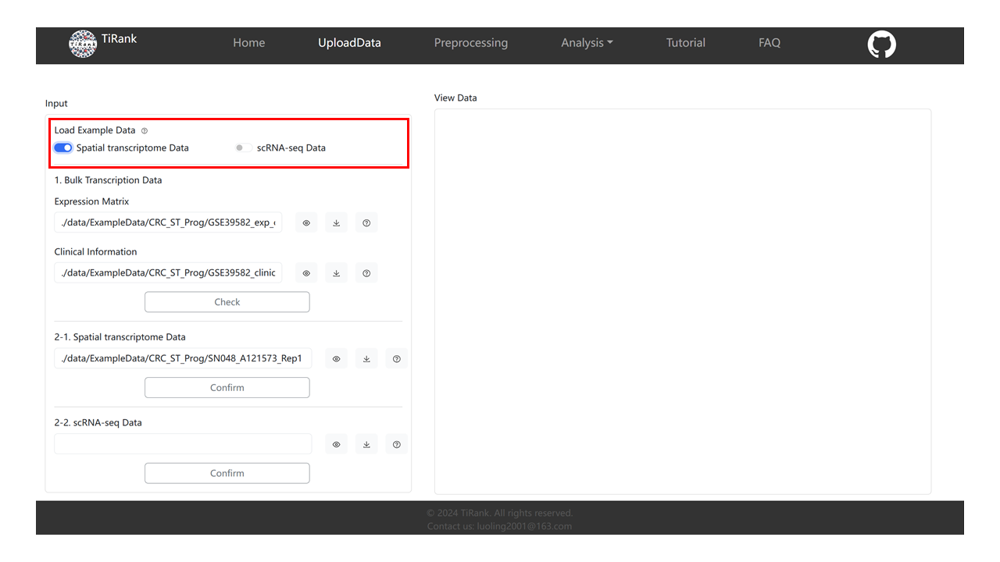
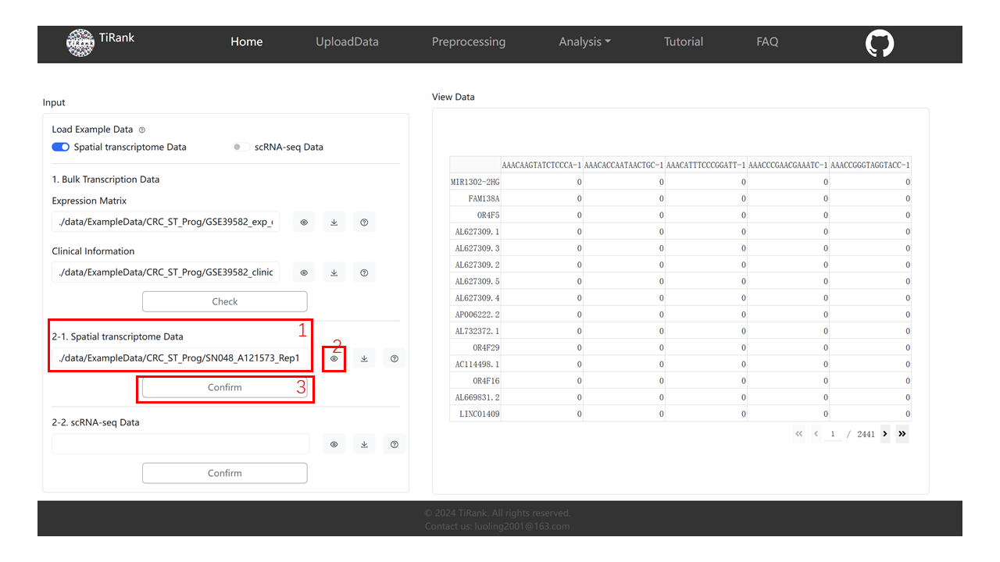
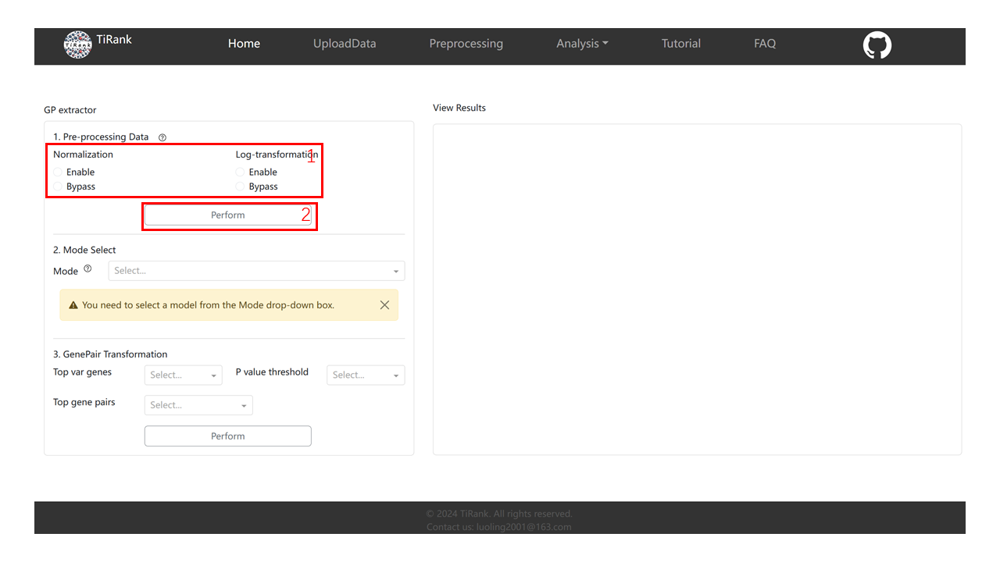
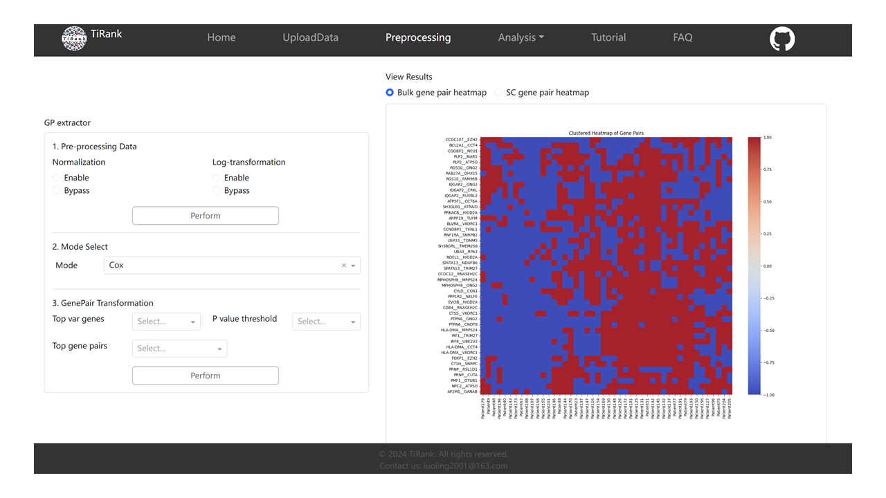
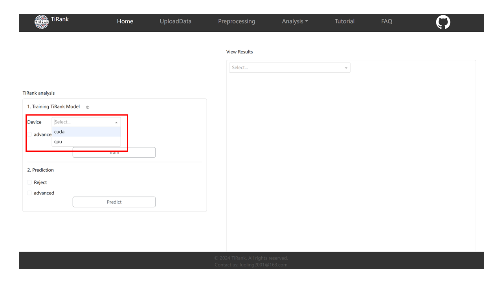
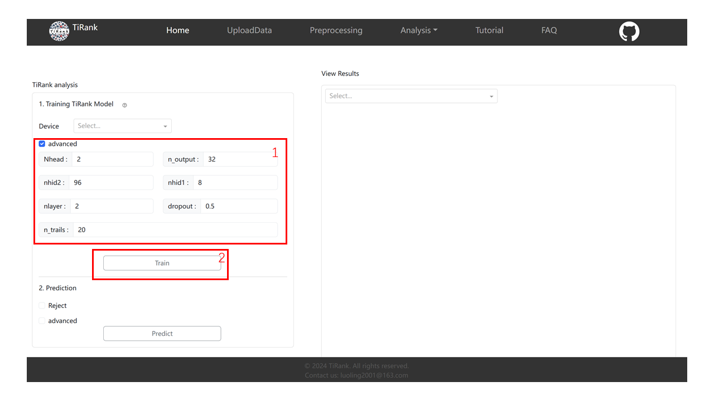
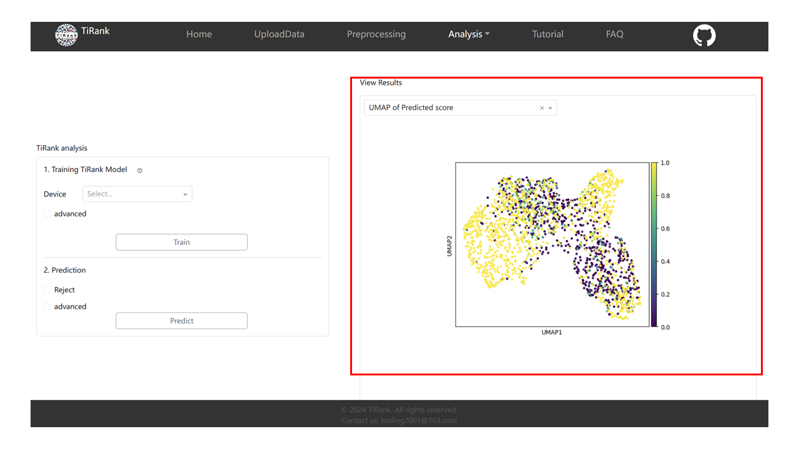
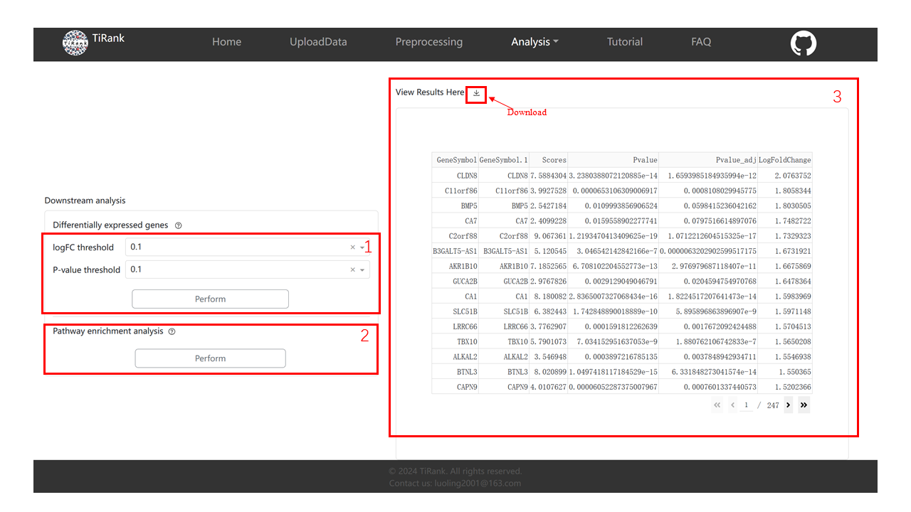

.. _tutorial_web:

========================
TiRank Web App Tutorial
========================

This tutorial provides a complete walkthrough of the TiRank web application.

.. note::
   This documentation references several images (e.g., ``load-data-tutorial.png``). For these images to display correctly when you build the documentation locally, please copy all image files from your project's ``Web/assets/`` directory into the ``docs/source/_static/`` directory.

Introduction of TiRank Web
--------------------------

The development of the TiRank-web application leverages the Python Dash framework (`https://dash.plotly.com <https://dash.plotly.com/>`_) a product of Plotly designed for the creation and deployment of data-driven applications with custom interfaces. TiRank-web is structured into six key sections: Homepage, Upload Data, Pre-processing, Analysis, Tutorial, and FAQs, aimed at enhancing user engagement and efficiency. 

In the Upload Data section, users can upload their datasets, which TiRank then organizes into designated folders for temporary storage and figure generation. 
The Pre-processing phase involves comprehensive data cleaning, normalization, and partitioning into training and validation subsets to enable hyperparameter optimization. 
This phase ends in the construction of a binary gene pair matrix, setting the stage for the subsequent Analysis phase. 
Here, a neural network model is employed to compute the 'TiRank Score', integrating a rejection mechanism for filtering out entities with low confidence. 
This phase also encompasses tools for differential gene expression analysis and pathway enrichment, thereby supporting biomarker discovery and further scientific investigation. 
The Tutorial and FAQs segments provide extensive guidance and address common questions, thus ensuring effective exploration of TiRank-web's capabilities.

----

Video Tutorial of TiRank Web
--------------------------

.. figure:: _static/TiRank_Youtub.png
   :alt: Watch the video
   :width: 400px
   :align: center
   :target: https://www.youtube.com/watch?v=YMflTzJF6s8

   `▶ Watch the video on YouTube <https://www.youtube.com/watch?v=YMflTzJF6s8>`_

----

1. UploadData
-------------

1.1 Load Example Data
~~~~~~~~~~~~~~~~~~~~~

To facilitate a clearer understanding of this system's utility, we provide exemplary datasets for both Spatial Transcriptomics (ST) and Single-cell RNA sequencing (scRNA-seq). In the accompanying figure on the right, users are given the option to select and load sample datasets pertaining to either 'Spatial Transcriptomics Data' or 'scRNA-seq Data'.

Upon selection of either the 'Spatial Transcriptomics Data' or 'scRNA-seq Data' button, The Expression Matrix and Clinical Information in the Bulk Transcription Data below will automatically fill the path of our sample data. Moreover, choosing 'Spatial Transcriptomics Data' will result in the auto-filling of the form labeled 2-1 with our Spatial Transcriptomics (ST) sample data. Conversely, opting for 'scRNA-seq data' will auto-complete the form labeled 2-2 with our Single-cell RNA sequencing (scRNA-seq) sample data.

**Hint: Only fill out one of the 2-1 form and the 2-2 form**

1.2 Bulk Transcription Data
~~~~~~~~~~~~~~~~~~~~~~~~~~~~~

Next, we will use the loaded ST data as an example to tell how the whole system is used.

1. Upon loading the sample data, the paths to the sample datasets will be automatically entered into the 'Expression Matrix' and 'Clinical Information' forms. Users also have the flexibility to input their own data by manually entering the **absolute paths** to their datasets in the respective forms.

2. After loading the Data, you can click the 'View' button (as shown in the second step of the right image) to visualize the loaded table data. The data will be displayed in the 'View Data' card on the right.

3. Finally, you need to click the 'Check' button to check whether the data format meets the requirements of the TiRank model.

.. image:: _static/bulk-data-tutorial.png
   :width: 640px
   :alt: Bulk Data Tutorial

1.3 Spatial transcriptome Data / scRNA-seq Data
~~~~~~~~~~~~~~~~~~~~~~~~~~~~~~~~~~~~~~~~~~~~~~~~~~

1. Upon loading the sample data, the paths to the sample datasets will be automatically entered into the 'Spatial transcriptome Data' **or** 'scRNA-seq Data' forms. Users also have the flexibility to input their own data by manually entering the **absolute paths** to their datasets in the respective forms.

2. Same as visualizing bulk data, you can click the 'View' button (as shown in the second step of the right image) to visualize the loaded table data. The data will be displayed in the 'View Data' card on the right.

3. Finally, you need to click the "Confirm" button to make sure that your data is ST data (as shown in step 3 of the right image, or in the 2-2 card if you are loading SC data). Moreover, this step is necessary because our subsequent processing of ST data is different from that of SC data.

----

2. Preprocessing
------------------

2.1 Pre-processing Data
~~~~~~~~~~~~~~~~~~~~~~~~~

1. In the data preprocessing section, you need to select "Enable" or "Bypass" to decide whether to perform Normalization and Log-transformation (as shown in the first step of the right image).

2. After that, you need to click the Perform button to preprocess the data.

   **Note**: The system will enter a Loading screen, this may take a few minutes, please do not do anything in the interim, until the data Preprocessing is completed, return to the preprocessing screen.

2.2 Mode select And GenePair Transformation
~~~~~~~~~~~~~~~~~~~~~~~~~~~~~~~~~~~~~~~~~~~~~~~

1. **Mode select:** Choose the mode you want.

2. **GenePair Transformation:** You need to select the values of 'Top var genes', 'P value threshold' and 'Top gene pairs' from the drop-down box. In addition, we recommend that you choose the parameter values listed below.

   .. code-block:: json

      'Top var genes': 2000
      'P value threshold': 0.05
      'Top gene pairs': 2000

   Finally, you need to click the 'Perform' button to perform the GenePair Transformation.

   **Note**: This is the same as the data Preprocessing, the system will enter a Loadding interface, which may take more time, please do not do anything in the meantime, until the data preprocessing is completed, return to the preprocessing interface.

.. image:: _static/preprocess-mode-tutorial.png
   :width: 640px
   :alt: Mode Select Tutorial

2.3 View Results
~~~~~~~~~~~~~~~~~~

After you have done the data preprocessing and GenePair Transformation, you can use the radio above the right card to select the resulting plot that you are interested in for observation.

----

3. Analysis/TiRank
--------------------

3.1 Device select
~~~~~~~~~~~~~~~~~~~

You first need to choose whether you want to use CPU or GPU to train the model. In the Device drop down box, you can choose Cpu or Cuda(training with GPU). Note that if you need to train the Tirank model with a GPU, you will need to install torch with the appropriate version of your graphics card driver. You can use the following command to check the version of your graphics card driver.

.. code-block:: bash

   nvidia-smi

You can then use the following code to see if the current GPU version of torch is available in your python environment.

.. code-block:: python

   import torch
   print(torch.cuda.is_available())

If the output is True, then you can use the GPU to train the model. If the output is False, it means that the current version of torch does not correspond to your GPU version, and you need to download the corresponding version of torch from the `Pytorch <https://pytorch.org/>`_ official website according to your GPU version.

3.2 Training TiRank Model
~~~~~~~~~~~~~~~~~~~~~~~~~~~

1. If necessary, you can click advanced to change the model parameters according to your needs. Or do not select advanced to use the default parameters. The default parameters we set are as follows.

   .. code-block:: json

      'Nhead': 2
      'n_output': 32
      'nhid1': 96
      'nhid2': 8
      'nlayers': 2
      'n_trails': 20
      'dropout': 0.5

2. Click the 'Train' button to start training the model. This will take a lot of time, so please be patient.

3.3 Prediction
~~~~~~~~~~~~~~~~

1. You can select 'Reject' to perform the rejection and 'advanced' to change the prediction parameters. The default parameters are as follows.

   .. code-block:: json

      'Tolerance': 0.05
      'Reject_mode': 'GMM'

2. Click the 'Predict' button to predict.

.. image:: _static/predict-tutorial.png
   :width: 640px
   :alt: Predict Tutorial

3.4 View Results
~~~~~~~~~~~~~~~~~~

When you have finished training and prediction, you can select the resulting graph that interests you in the drop-down box in the upper left corner of the right card for observation.

----

4. Analysis/Differential expression genes & Pathway enrichment
--------------------------------------------------------------

1. **Differential expression genes**: You need to select the logFC threshold and P-value threshold values from the drop-down boxes and click the "Perform" button to execute.

2. **Pathway enrichment**: You just need to click the 'Perform' button to perform Pathway enrichment analysis very easily.

3. **View Results**: When you have finished the differential gene analysis, you can see the analysis results on the right and click the download button to download them.

