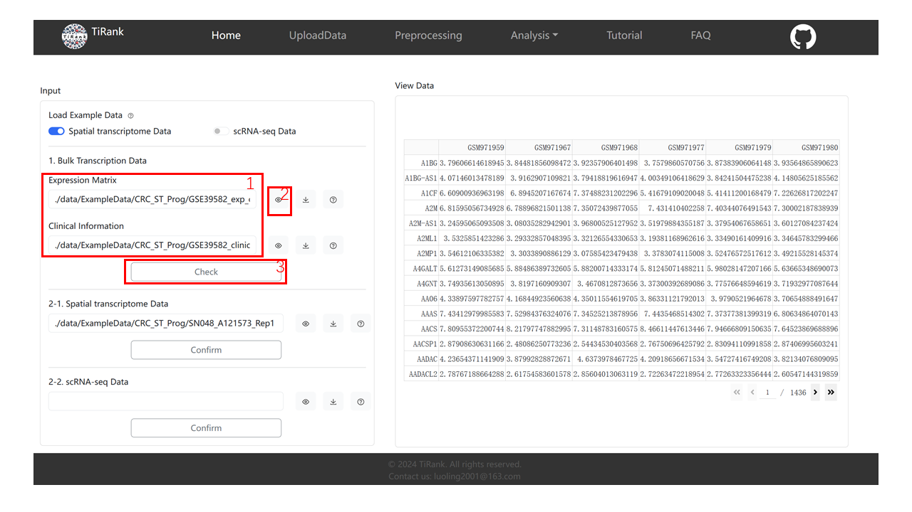
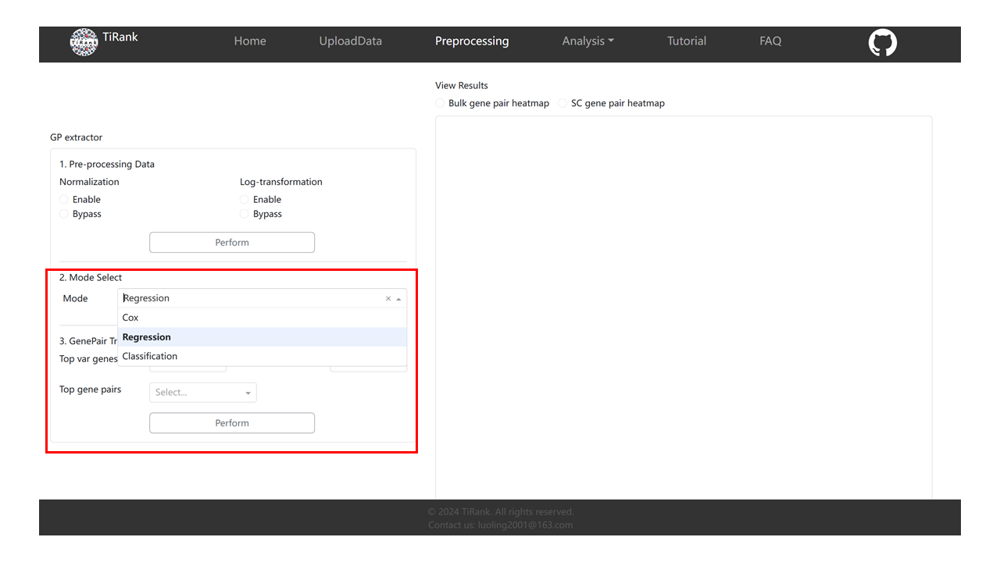

.. _tutorial_web:

========================
TiRank Web App Tutorial
========================

This tutorial provides a complete walkthrough of the TiRank web application.

.. note::
   This documentation references several images (e.g., ``load-data-tutorial.png``). For these images to
   display correctly when you build the documentation locally, please copy all image files from your
   project's ``Web/assets/`` directory into the ``docs/source/_static/`` directory.

Introduction of TiRank Web
--------------------------

The TiRank web application is built with the Python Dash framework (https://dash.plotly.com).
TiRank-web is organized into six sections: Homepage, Upload Data, Pre-processing, Analysis, Tutorial,
and FAQs.

In Upload Data, users provide datasets that TiRank organizes into designated folders for temporary
storage and figure generation. Pre-processing covers data cleaning, normalization, and splitting
(training/validation) for hyperparameter optimization, and prepares the binary gene-pair matrix for
downstream modeling. The Analysis section trains the model, computes TiRank scores, and supports
differential expression and pathway enrichment.

Video Tutorial of TiRank Web
----------------------------

The archived, citable GUI tutorial video is hosted on Zenodo:

- Zenodo DOI: https://doi.org/10.5281/zenodo.18275554

.. figure:: _static/TiRank_Youtub.png
   :alt: TiRank GUI tutorial video
   :width: 400px
   :align: center
   :target: https://doi.org/10.5281/zenodo.18275554

   Download the GUI tutorial video (``TiRank GUI Tutorial.mp4``) from Zenodo.

(Optional) Streaming mirror (non-archival): https://www.youtube.com/watch?v=YMflTzJF6s8

----

1. UploadData
-------------

1.1 Load Example Data
~~~~~~~~~~~~~~~~~~~~~

We provide exemplary datasets for both Spatial Transcriptomics (ST) and scRNA-seq. The archived
example datasets are available from Zenodo (see DOI above). The Zenodo record includes:

- ``ExampleData.zip`` (example datasets)
- ``ctranspath.pth`` (pretrained model file)
- ``TiRank GUI Tutorial.mp4`` (GUI tutorial video)

To use the "Load Example Data" buttons in the local GUI, ensure the example datasets and pretrained
model file are extracted and placed under ``Web/data/`` as described in :doc:`installation`.

In the GUI (right-side panel), users can select either “Spatial Transcriptomics Data” or “scRNA-seq Data”.
Once selected, the relevant form fields will be auto-populated with the sample paths.

**Hint:** Only fill out one of the ST (2-1) or scRNA-seq (2-2) forms.

.. image:: _static/load-data-tutorial.png
   :width: 640px
   :alt: Load Example Data

1.2 Bulk Transcription Data
~~~~~~~~~~~~~~~~~~~~~~~~~~~

We use the loaded ST example as an illustration.

1. After loading, the paths to the bulk expression matrix and clinical information are automatically
   filled. You may also enter your own **absolute paths** manually.

2. Click “View” to visualize the loaded table.

3. Click “Check” to validate input format for TiRank.

1.3 Spatial transcriptome Data / scRNA-seq Data
~~~~~~~~~~~~~~~~~~~~~~~~~~~~~~~~~~~~~~~~~~~~~~~

1. After loading, the ST (or scRNA-seq) paths are auto-filled; you may also enter your own **absolute paths**.

2. Click “View” to visualize the loaded data.

3. Click “Confirm” to indicate whether your data is ST or scRNA-seq (required because downstream
   processing differs).

----

2. Preprocessing
----------------

2.1 Pre-processing Data
~~~~~~~~~~~~~~~~~~~~~~~

1. Select “Enable” or “Bypass” for Normalization and Log-transformation.
2. Click “Perform” to preprocess.

**Note:** The system may show a loading screen for several minutes; please wait until preprocessing completes.

2.2 Mode select And GenePair Transformation
~~~~~~~~~~~~~~~~~~~~~~~~~~~~~~~~~~~~~~~~~~~

1. **Mode select:** Choose the mode you want.
2. **GenePair Transformation:** Select parameters (recommended defaults below), then click “Perform”.

.. code-block:: json

   'Top var genes': 2000
   'P value threshold': 0.05
   'Top gene pairs': 2000

**Note:** This step may take longer; wait until processing completes.

2.3 View Results
~~~~~~~~~~~~~~~~

After preprocessing and gene-pair transformation, use the radio controls above the right card to select
and view result plots.

.. image:: _static/preprocess-view-res-tutorial.png
   :width: 640px
   :alt: View Preprocessing Results

----

3. Analysis/TiRank
------------------

3.1 Device select
~~~~~~~~~~~~~~~~~

Select CPU or GPU. If you use GPU, ensure PyTorch is installed for your CUDA/driver.

Check GPU driver:

.. code-block:: bash

   nvidia-smi

Check CUDA availability in Python:

.. code-block:: python

   import torch
   print(torch.cuda.is_available())

.. image:: _static/device-tutorial.png
   :width: 640px
   :alt: Device Select Tutorial

3.2 Training TiRank Model
~~~~~~~~~~~~~~~~~~~~~~~~~

Optionally click “Advanced” to change parameters. Default parameters:

.. code-block:: json

   'Nhead': 2
   'n_output': 32
   'nhid1': 96
   'nhid2': 8
   'nlayers': 2
   'n_trails': 20
   'dropout': 0.5

Click “Train” to start training (this can take time).

.. image:: _static/train-tutorial.png
   :width: 640px
   :alt: Train Model Tutorial

3.3 Prediction
~~~~~~~~~~~~~~

Optionally enable rejection and adjust prediction parameters. Default parameters:

.. code-block:: json

   'Tolerance': 0.05
   'Reject_mode': 'GMM'

Click “Predict”.

.. image:: _static/predict-tutorial.png
   :width: 640px
   :alt: Predict Tutorial

3.4 View Results
~~~~~~~~~~~~~~~~

After training/prediction, choose result plots from the dropdown menu to view.

.. image:: _static/train-predict-tutorial.png
   :width: 640px
   :alt: View Analysis Results

----

4. Analysis/Differential expression genes & Pathway enrichment
--------------------------------------------------------------

1. **Differential expression genes:** set logFC and P-value thresholds and click “Perform”.
2. **Pathway enrichment:** click “Perform”.
3. **View Results:** inspect results on the right and download if needed.

